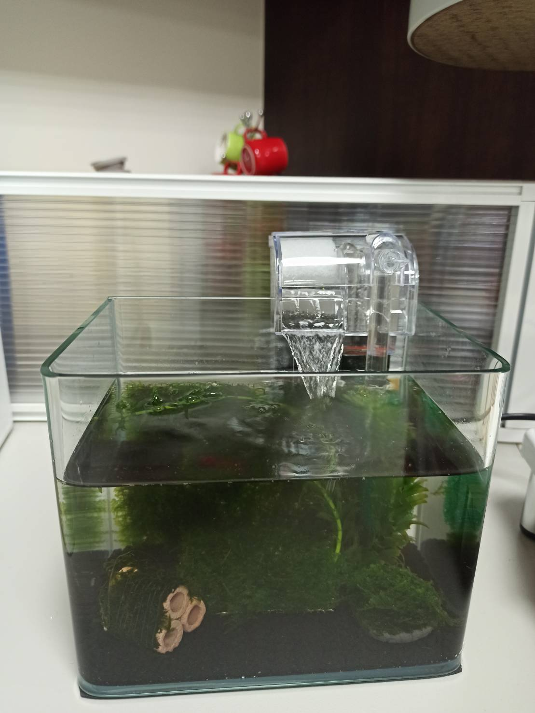

# 蝦蝦的養殖人生
---

+ ## 20210819
    **小蝦蝦誕生了**
    **系秘說鍋牛要弄掉**
    
    
    

+ ## 20210818
    **蝦蝦沒活力了，系秘說應該是沒氧氣的關係，我把網子移動一下，讓水裡打出氣泡**
    **有蝦蝦又脫殼了，蠻完整的**
    
    

+ ## 20210817
    **換了網子，水流聲變小，蝦蝦也更有活力了**
    **要清理便便跟飼料，飼料倒太多，蝦蝦太久沒吃會發霉也會讓水質變差**
    **系秘開始直播了啊**
    
    
    
    

+ ## 20210816
    **蝦蝦脫殼了**
    **水流太強，蝦蝦活動力低，減少水流力**
    
    
    

+ ## 20210813
    **去台北水街買蝦蝦來養**
    
    
    
    
    
    

+ ## 20210810
    **加入菌種培養**
    
    
    **據說這些石頭也是培養菌種的**
    

+ ## 20210809
    **第一個假日後的觀察**
    
    

+ ## 20210806
    **購置**
    
    
    **佈置**
    
    
    
    
    
    
    
    

